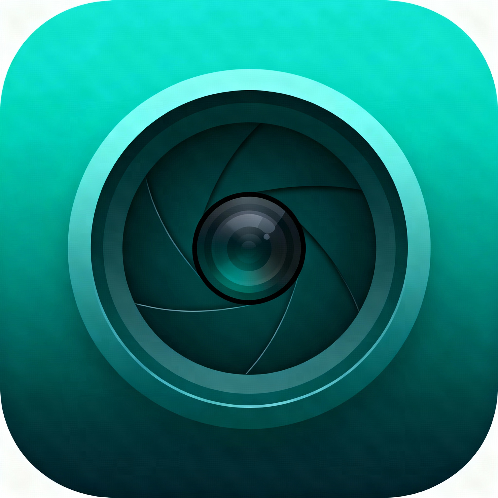

# 📷 Film Light Meter

A professional light meter web app designed for film photographers. Calculate perfect exposure settings based on lighting conditions with an intuitive, touch-optimized interface.



## ✨ Features

- **Real-time Exposure Calculation** - Get accurate aperture and shutter speed combinations
- **Film ISO Support** - Set your film stock ISO (50-6400)
- **Exposure Compensation** - ±3 EV adjustment for creative control
- **Lock Controls** - Lock aperture or shutter speed to adjust the other automatically
- **Touch-Optimized** - Smooth scrolling wheels and large touch targets for mobile use
- **PWA Ready** - Install as a native-like app on your phone
- **Offline Support** - Works without internet connection once installed
- **Light/Dark Mode** - Automatic theme based on system preferences

## 🎯 Perfect For

- Manual film camera shooters
- Photographers using cameras without built-in meters
- Learning the exposure triangle
- Backup light meter on your phone
- Quick exposure reference in the field

## 🚀 Quick Start

### Try it Online
Visit: //Hosted URL Here//

### Install as App
//1. Open the link on your phone//
//2. Tap "Add to Home Screen" (iOS) or "Install" (Android)//
//3. Use it like a native app!//

## 📱 How to Use

1. **Set Film ISO** - Adjust the slider to match your film stock
2. **Choose Lighting Condition** - Select the scene brightness
3. **Tap MEASURE** - Calculate exposure values
4. **Adjust Settings**:
   - Scroll aperture or shutter wheels to change values
   - Lock one parameter to auto-adjust the other
   - Use EV compensation for creative exposure
5. **Shoot!** - Apply the settings to your camera

## 🛠️ Installation for Development

```bash
# Clone the repository
git clone https://github.com/yourusername/film-light-meter.git
cd film-light-meter

# Open in browser
# Simply open index.html in your browser
# No build process needed!
```

## 📂 Project Structure

```
film-light-meter/
├── index.html          # Main app file
├── manifest.json       # PWA configuration
├── sw.js              # Service worker for offline support
├── icon-192.png       # App icon (192x192)
├── icon-512.png       # App icon (512x512)
└── README.md          # This file
```

## 🎨 Design System

Built with a custom design system featuring:
- Teal primary color (#21808D)
- Dark/Light mode support
- Responsive typography
- Touch-friendly components
- Smooth animations

## 🔧 Technologies

- Pure HTML5, CSS3, JavaScript (ES6+)
- CSS Custom Properties for theming
- Service Workers for offline capability
- Progressive Web App (PWA) standards
- No frameworks or dependencies

## 📖 Exposure Triangle Reference

The app uses the standard exposure value (EV) formula:

```
EV = log₂(f²/t) - log₂(ISO/100)
```

Where:
- `f` = f-number (aperture)
- `t` = shutter speed in seconds
- `ISO` = film sensitivity

## 🌐 Browser Support

- ✅ Chrome/Edge (recommended)
- ✅ Safari
- ✅ Firefox
- ✅ Mobile browsers (iOS Safari, Chrome Mobile)

## 📱 Publishing to App Stores

### Android (Google Play)

1. Host the app online (GitHub Pages, Netlify, etc.)
2. Go to [PWABuilder.com](https://www.pwabuilder.com/)
3. Enter your URL and package for Android
4. Upload to Google Play Console

### iOS (App Store)

PWA support on iOS works through Safari. For App Store:
1. Use PWABuilder to create iOS package
2. Submit through App Store Connect

## 🤝 Contributing

Contributions are welcome! Feel free to:
- Report bugs
- Suggest new features
- Submit pull requests
- Improve documentation

## 📄 License

MIT License - feel free to use this project for personal or commercial purposes.

## 🙏 Acknowledgments

- Inspired by professional light meter apps
- Built for the film photography community
- Design system based on modern UI principles

## 📧 Contact

- GitHub: [@yourusername](https://github.com/yourusername)
- Email: your.email@example.com

## 🎬 Screenshots

//Add screenshots of app//

---

**Happy Shooting! 📸**

*Made with ❤️ for film photographers*
